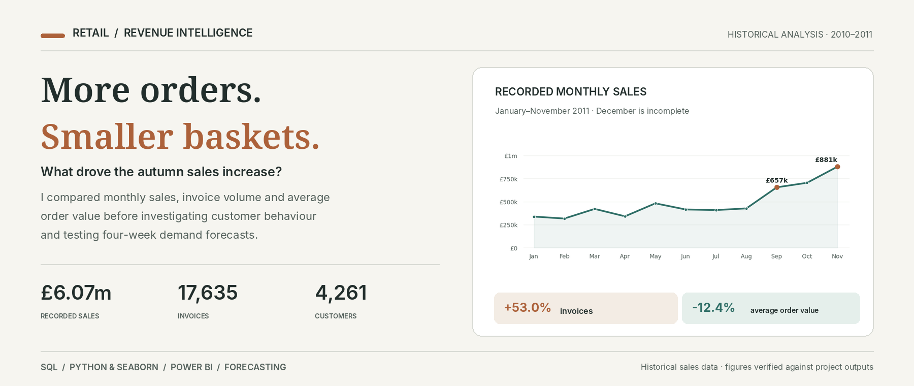
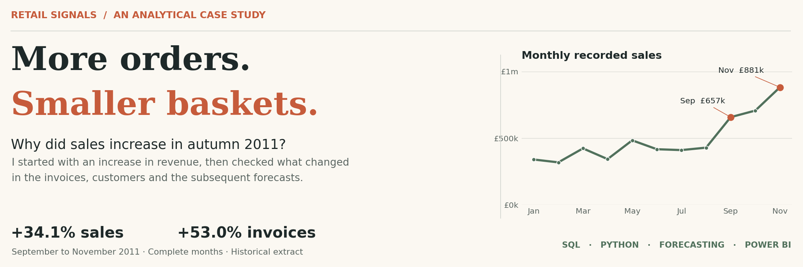
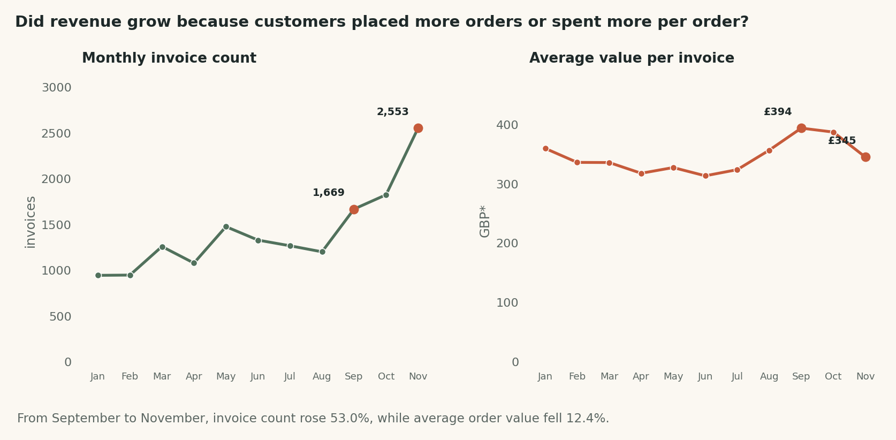
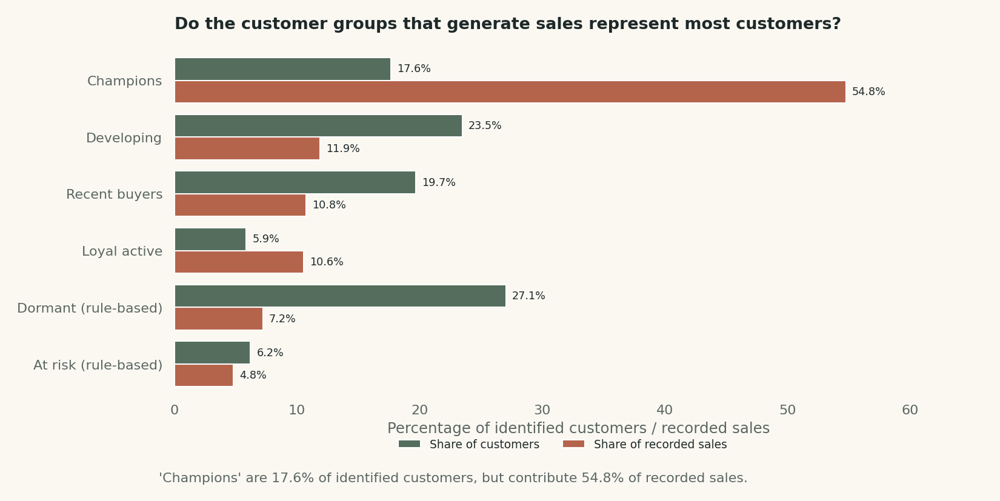
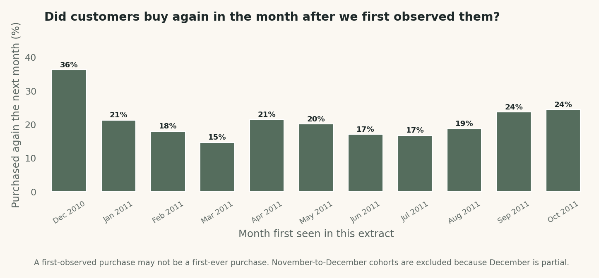
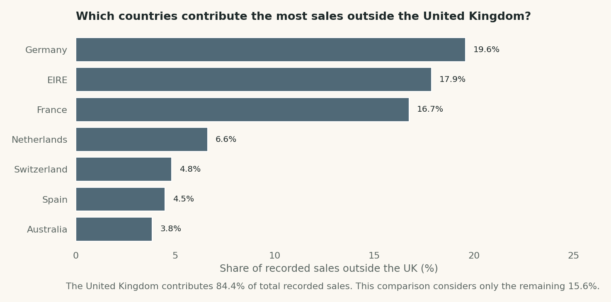
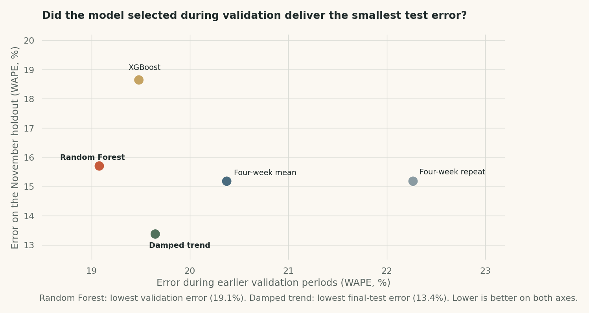

# Retail Signals: Why did sales rise when customers spent less per order?

*This cover uses verified monthly sales data from the project. December 2011 is excluded from the chart because the month is incomplete.*

*The cover and additional charts below were plotted with Python and Seaborn from the project's verified result files. They are not AI-generated artwork or Power BI screenshots.*

This project began with a question that a monthly revenue chart could not answer. Sales increased considerably in autumn 2011, but I wanted to understand whether customers were placing more orders, spending more on each order, or doing both. That question led me from transaction cleaning and sales analysis to customer retention and, eventually, a forecasting experiment comparing statistical methods with machine learning.

I used **SQL and Python** for the investigation and built **interactive reports and an editable Power BI project** to explore the results. The data is a historical, filtered online-retail extract containing **384,721 transaction lines, 17,635 invoices and 4,261 identified customers**, covering **1 December 2010 to 9 December 2011** after correcting its dates.

**The central finding:** Between September and November 2011, recorded sales rose by **34.1%**. The number of invoices increased by **53.0%**, while average order value **fell by 12.4%**. In this period, growth came from more orders, not larger baskets.

[Explore the interactive sales and customer dashboard](report/interactive_dashboard.html) · [Read the sales and customer report](report/executive_field_report.pdf) · [Examine the forecasting comparison](report/ml_forecast_comparison.html) · [Open the Power BI project](powerbi/OPEN_IN_DESKTOP.md)

## How the investigation developed

| Question I investigated | Answer from this dataset |
|---|---|
| Did autumn revenue increase because customers spent more per order? | No. September–November sales increased by **34.1%**, but average order value decreased by **12.4%**. The number of invoices rose by **53.0%**. |
| How important were customers who purchased more than once? | **2,773 of 4,261** observed customers placed at least two invoices. They generated **92.1%** of recorded sales across the extract. |
| Did customers continue buying after their first observed purchase? | **36.2%** of the December 2010 cohort purchased again the following month, compared with **21.3%** of the January 2011 cohort. |
| Were sales spread evenly across markets? | No. The United Kingdom accounted for **84.4%** of recorded sales value. |
| Could forecasting methods anticipate the late-autumn volume? | The validation-selected **Random Forest** recorded **15.7% error** on the final four-week test. An eight-week damped trend achieved **13.4%** on that same test, although it was not the validation-selected model in the five-method comparison. |

These results describe **one historical transaction extract**. The file is filtered to positive quantities and prices, and its currency is not explicitly recorded. I use GBP as a source-context assumption, not as a field independently verified in the CSV.

---

## 1. Could I trust the transaction dates?

Before comparing sales over time, I checked whether the dates represented the right days and months. The first invoice, for example, appeared as **12 January 2010**, even though the invoice sequence and source observation window indicated **1 December 2010**. A time-series analysis built on the uncorrected dates would have been unreliable.

I checked the date pattern across the entire file. **147,998 rows** needed their day and month reversed. In the original data, ordering invoices by number produced **21 backward jumps** in transaction dates. After repairing the ambiguous dates, that particular inconsistency disappeared. I then recalculated the calendar fields rather than using the year and month columns that came with the extract.

There was a second decision to make: **5,178 rows were exact duplicates**. I retained them in the main analysis because the extract has no unique invoice-line identifier; two identical lines might be legitimate purchases rather than an export error. To show the effect of that choice, I also calculated sales after removing repeated copies. Recorded sales would fall by **23,119.37**, approximately **0.38%** of the total.

This cleaning work mattered because it changed the dates used in every subsequent comparison. It also established which assumptions a reader would need to reproduce the results.

[See the date-repair SQL](sql/00_schema_and_date_repair.sql) · [Review the data-quality checks](sql/06_quality_and_sensitivity.sql) · [Read the source and scope notes](data/SOURCE_AND_SCOPE.md)

## 2. What actually explains the autumn sales increase?

Once the dates were corrected, the monthly chart showed a rise towards the end of 2011. I compared **September and November** because both are complete months in this extract; December ends on the ninth day and would distort a full-month comparison.

*The two measures answer different questions. November had **2,553 invoices**, versus **1,669** in September; average order value fell from **£393.89 to £345.19** (currency assumed from source context). [View the full monthly revenue curve](charts/01_monthly_sales.png).*

| Measure | September 2011 | November 2011 | Change |
|---|---:|---:|---:|
| Recorded sales value (assumed GBP) | £657,406 | £881,271 | **+34.1%** |
| Distinct invoices | 1,669 | 2,553 | **+53.0%** |
| Average value per invoice | £393.89 | £345.19 | **−12.4%** |

The distinction is important. Looking only at sales, I might have concluded that customers were spending more. The order figures show the opposite at the invoice level: **there were substantially more invoices, but each invoice was worth less on average**. The additional order volume more than offset the decrease in average order value.

The data does not explain *why* that happened. Prices, product mix, promotions, existing customers and newly observed customers could all have contributed. Rather than selecting an explanation without evidence, I moved to the customer data.

[See the invoice and order-value comparison](charts/02_orders_vs_aov.png) · [Reproduce the sales calculation in SQL](sql/01_revenue_decomposition.sql)

## 3. Were returning customers responsible for most recorded sales?

The next question was whether sales were concentrated among customers who bought repeatedly. Of the **4,261 identified customers**, **2,773** placed at least two distinct invoices during the observed period. Together, they contributed **92.1% of recorded sales**.

That is a useful description of the existing customer base, but it is not a retention rate. It groups customers using everything we know about them at the *end* of the dataset. I therefore examined customer behaviour in two different ways.

First, I calculated recency, frequency and monetary value (RFM) from each customer's recorded transactions. Under the project's documented, rule-based segmentation, the **Champions** group accounted for **54.8% of recorded sales**. The label is a way to describe observed purchasing behaviour; it is not a prediction of future loyalty or customer lifetime value.

*This comparison adds useful context: the **Champions** category contains **17.6% of identified customers**, yet accounts for **54.8% of recorded sales**. These segment boundaries were defined for this analysis; they are not a validated churn model.*

Second, I created monthly cohorts using each customer's **first appearance in this extract**. I then checked how many customers returned in later observed months. **36.2% of the December 2010 cohort** bought again the following month, whereas **21.3% of the January 2011 cohort** did so. These numbers make the difference between lifetime repeat purchasing and month-to-month return behaviour visible. They do not show when those people first became customers of the business.

*For customers first observed in **December 2010**, **36.2%** appeared again the next month; the corresponding figure for **January 2011** was **21.3%**. [The complete month-by-month cohort matrix](charts/04_cohort_retention.png) shows what happened over longer follow-up periods.*

[Explore the customer segments](charts/03_customer_segments.png) · [Review the cohort query](sql/03_customer_cohorts.sql) · [Inspect the segmentation rules](sql/04_rfm_segmentation.sql)

## 4. Did particular markets or products dominate the results?

Before generalising the customer findings, I checked where recorded sales originated. The **United Kingdom contributed 84.4%** of the extract's sales value, so this is primarily a view of one national market rather than a balanced international sample. I also created a separate non-UK view so that smaller markets would remain visible without distorting the comparison.

*The UK accounts for **84.4%** of all recorded sales. Among sales **outside** the UK, Germany contributes **19.6%**, EIRE **17.9%** and France **16.7%**. Those percentages have a different denominator from the UK share.*

I then compared products by recorded sales value and quantity sold. Those are different measures: selling many inexpensive units does not necessarily produce the highest revenue. **Regency Cakestand 3 Tier (stock code 22423)** generated the highest recorded product sales value, at **112,370.95** in assumed GBP.

These checks helped me understand the composition of sales, but I did not turn them into a profitability claim. The file contains selling prices, not the product costs required to calculate margins.

[View the non-UK market comparison](charts/05_non_uk_markets.png) · [View product sales](charts/06_products.png) · [See the SQL investigation](sql/05_products_and_geography.sql)

## 5. Could I have anticipated the late-autumn increase?

Explaining a rise after it happens is different from predicting it. I wanted to test whether the sales history available *before November* contained enough information to forecast the next four weeks.

I forecast **weekly units sold**, not revenue, because price changes would complicate a forecast intended to capture sales volume. I started with three interpretable methods: a four-week moving average, repetition of the previous four weeks, and an eight-week damped trend. I evaluated all three over **five historical, four-week validation windows**, then kept **7 November to 4 December 2011** separate for the final test.

In the original statistical-only experiment, the damped trend was selected from those three candidates. It forecast approximately **371,695 units** against **429,081 observed units**, giving **13.4% weighted absolute percentage error (WAPE)**. The simple four-week average recorded **15.2% WAPE**. The damped trend improved on that baseline, but it still underestimated recorded volume by about **57,386 units**.

I repeated the exercise for five relatively active products selected using only early purchasing history. Their outcomes varied, which was a useful warning against assuming that an improvement in the total-sales forecast would automatically hold for individual products.

[See the four-week forecast and actual sales](charts/07_demand_forecast_backtest.png) · [Explore the forecasting report](report/forecast_experiment.html) · [Open the forecasting notebook](notebooks/retail_demand_forecasting.ipynb)

## 6. Would Random Forest or XGBoost improve the forecasts?

After establishing a statistical benchmark, I tested two machine-learning alternatives: **Random Forest** and **XGBoost**. The main question was not whether I could train an ML model, but whether its predictions would be more accurate on data it had not seen.

To train the models, I combined weekly observations from **120 relatively active products** selected before the first validation window. The features included the previous eight weeks of sales, recent averages and variation, and calendar information available at forecast time. Each model predicted the four future weeks directly, rather than using actual future sales as inputs.

I kept the **same five historical validation windows and the same final four-week test** used in the statistical experiment. That made it possible to compare all five methods without changing the test to favour the ML models. I selected the model based on validation performance, not on its eventual November result.

| Forecasting method | Validation WAPE | Final test WAPE |
|---|---:|---:|
| Four-week moving average | 20.37% | 15.18% |
| Repeat the previous four weeks | 22.27% | 15.18% |
| Eight-week damped trend | 19.65% | **13.37%** |
| Random Forest | **19.08%** | 15.70% |
| XGBoost | 19.48% | 18.64% |

**Random Forest was the validation-selected model**, but it did not achieve the lowest error on the untouched final test. It recorded **15.70% WAPE**, compared with **13.37% for the damped trend**. XGBoost recorded **18.64%**. This is a comparison of observed outcomes, not a reason to go back and choose a different model using the test data.

*The scatterplot shows why model selection and final evaluation must stay separate. **Random Forest** had **19.1% validation WAPE**, while the **damped trend** achieved **13.4% WAPE** on the final test. Each dot represents one forecasting method, not a separate test period.*

This result changed how I would continue the project. The ML models learned from a larger product-level training panel, but the underlying dataset still contains only about **52 complete weeks**. It lacks promotion schedules and stock-availability records, and only one late-autumn period is available for the final test. I would gather more seasons and evaluate more forward periods before treating a small model difference as dependable.

[Read the ML experiment](report/ml_forecast_comparison.html) · [Open its executed notebook](notebooks/retail_ml_forecast_comparison.ipynb) · [Inspect the model code](scripts/ml_forecast_comparison.py) · [Read the experimental methodology](docs/ml_methodology.md)

## What I learned, and what I would check next

The most useful sales finding was not that autumn revenue increased. It was that **invoice volume increased faster than sales while the average invoice became smaller**. Customer analysis showed how much recorded sales came from people who purchased more than once, but the limited observation window prevented me from interpreting that figure as future retention.

Forecasting raised a different lesson. More flexible methods did not automatically give better results: **the Random Forest model selected during validation was less accurate than the damped trend on the final aggregate test**. I would not use the November result to revise the original model selection; I would test both approaches over additional historical periods.

With more data, my next investigations would be to separate the September–November increase by customer group and product mix, and to add promotions and stock availability to the forecasting models. Without product costs, returns and cancellation records, I also cannot make claims about profit, net sales or unmet demand.

## Explore or reproduce the analysis

| Area | Files |
|---|---|
| SQL and data preparation | [PostgreSQL setup](sql/POSTGRES_SETUP.md) · [SQL investigations](sql/) · [Data-quality and scope notes](data/SOURCE_AND_SCOPE.md) |
| Sales and customer analysis | [Executed notebook](notebooks/retail_investigation.ipynb) · [Interactive dashboard](report/interactive_dashboard.html) · [Four-page report](report/executive_field_report.pdf) |
| Historical statistical forecasting | [Forecasting notebook](notebooks/retail_demand_forecasting.ipynb) · [Forecasting dashboard](report/forecast_experiment.html) |
| Machine-learning comparison | [ML notebook](notebooks/retail_ml_forecast_comparison.ipynb) · [Model comparison](report/ml_forecast_comparison.html) · [Validation results](results/ml_validation_folds.csv) |
| Power BI | [Editable four-page Power BI project](powerbi/Retail_Revenue_Intelligence.pbip) · [Instructions for opening it](powerbi/OPEN_IN_DESKTOP.md) |
| Verification and figures | [Computed aggregate results](results/) · [Automated checks](tests/) · [Reproduce the Seaborn charts and cover](scripts/plot_editorial_story.py) |

The original transactional CSV is **not redistributed** in this repository. The calculations were based on a user-supplied, 13-column positive-transaction extract with SHA-256:

`a4b796f9bd7a07f3881429bcc64165d0d03578a1b9f03a800eb4baebb0737a9a`

Readers with that exact file can save it as `data/raw/Online Retail.csv` and follow the [repository setup instructions](GITHUB_PUBLISHING.md). The related [UCI Online Retail dataset](https://archive.ics.uci.edu/dataset/352/online+retail) should not be assumed to reproduce this filtered extract exactly.

**Interpretation limits:** The currency is assumed to be GBP based on the source context, not verified from a currency field. The file excludes the observations needed to measure returns and cancellations. A first-observed purchase is not necessarily a customer's first-ever purchase, and recorded quantities sold are not the same as total customer demand.

The Power BI project was generated and structurally checked, but **it has not been opened and visually verified in Windows Power BI Desktop**. Its visual definitions are editable. The editorial cover and additional figures were created with Python and Seaborn from the verified summary files and are **not Power BI screenshots**. Recreate them with `python scripts/plot_editorial_story.py` after installing the dependencies.
