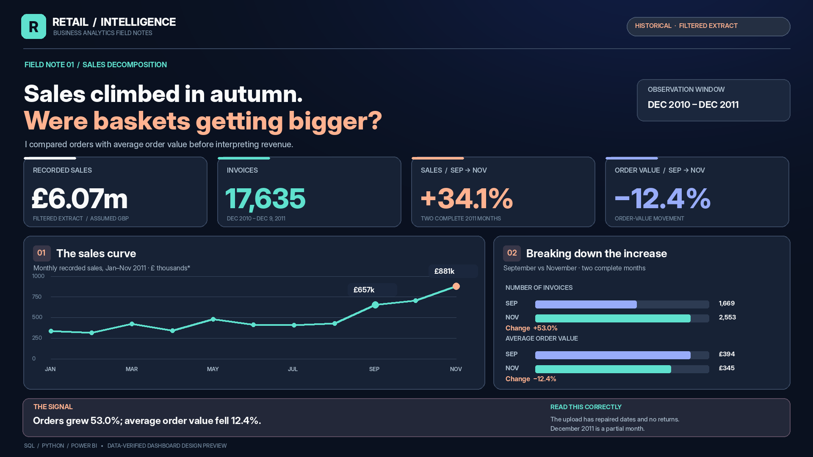
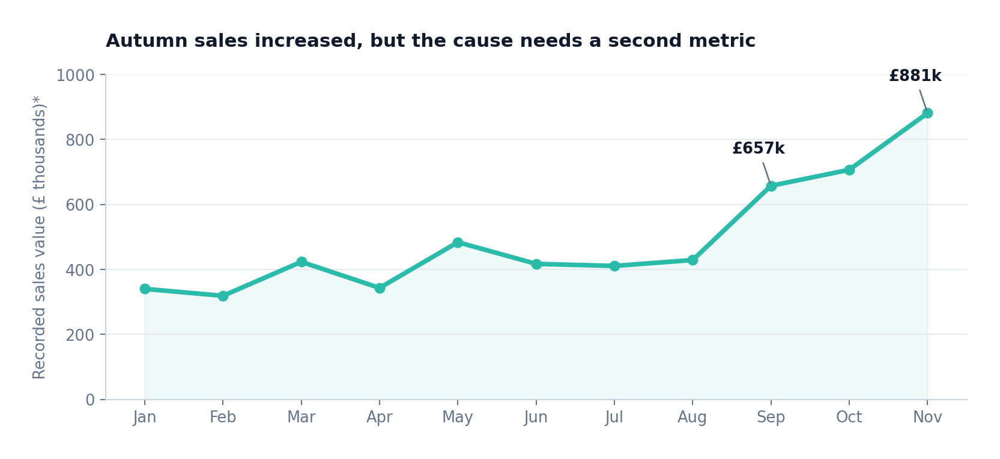
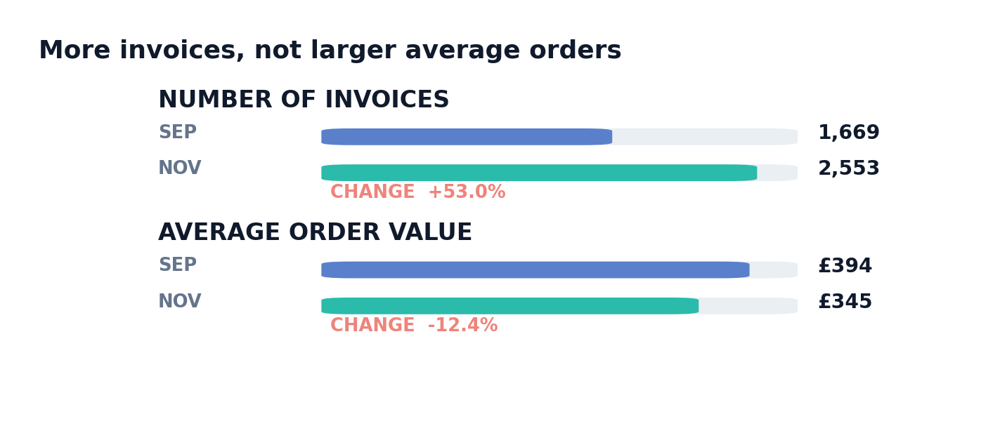
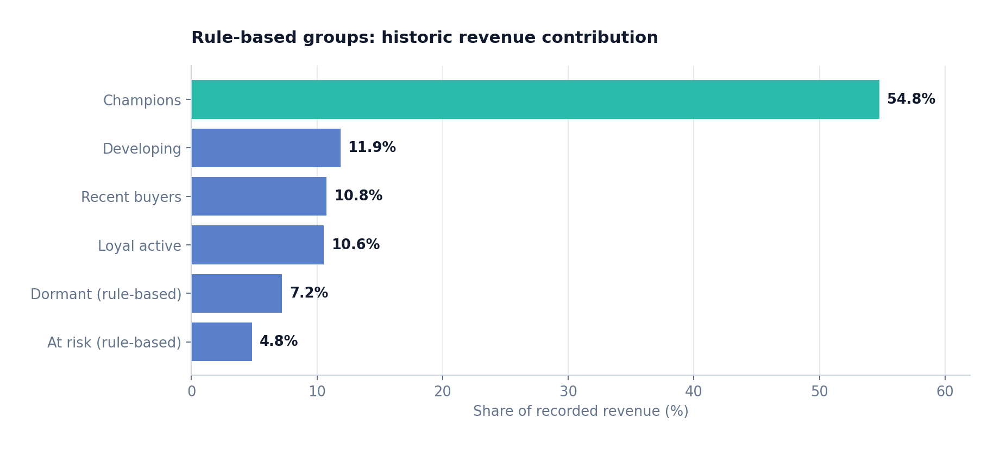
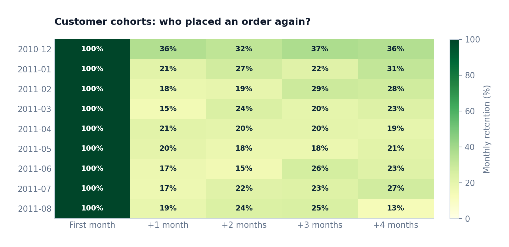
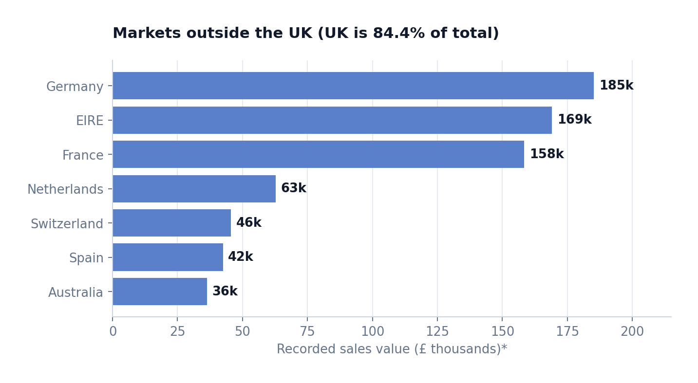
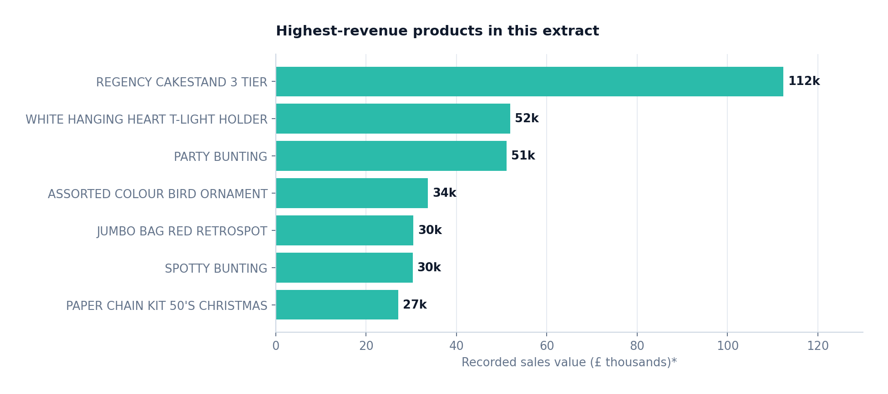
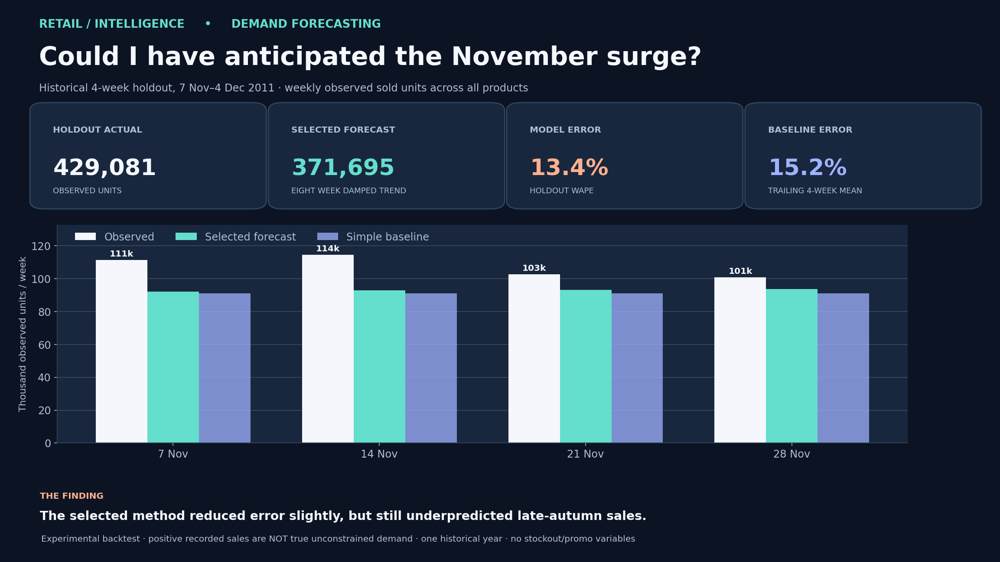
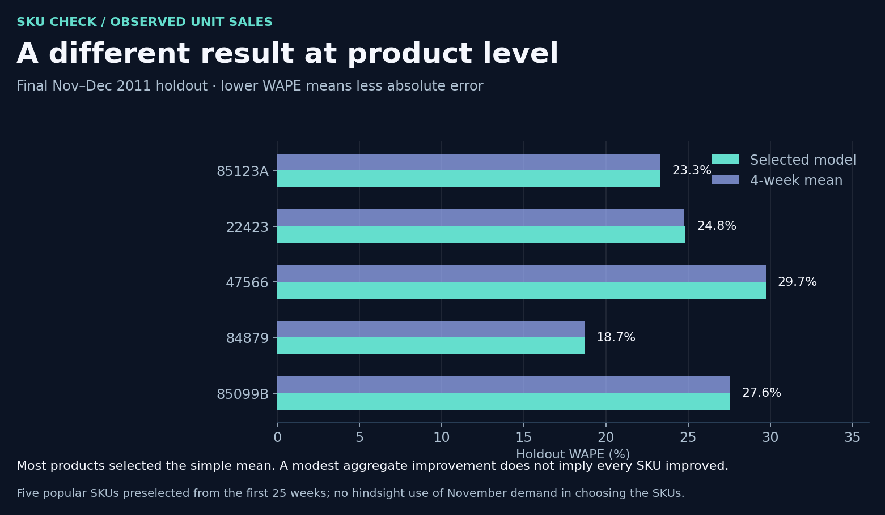

# Retail Signals: Sales grew. Were customers actually spending more?



*This is a **dashboard design preview**, not a screenshot of a published Power BI report. The figures are from the actual analysis.*

**SQL · Python · Power BI** &nbsp; | &nbsp; **384,721 recorded line items** &nbsp; | &nbsp; **Dec 2010 – 9 Dec 2011**

[Explore the sales/customer dashboard](report/interactive_dashboard.html) · [Explore the forecasting dashboard](report/forecast_experiment.html) · [Read the four-page field report](report/executive_field_report.pdf) · [Open the executed notebook](notebooks/retail_investigation.ipynb) · [Inspect the SQL](sql/) · [Open the Power BI setup guide](powerbi/OPEN_IN_DESKTOP.md)

## Where I started

At first, this looked like a fairly standard sales dataset: invoices, prices, quantities, customers, products and countries. Plot monthly revenue, list the most valuable products, build a dashboard. I could have stopped there, but a revenue curve doesn't explain *what changed*.

The autumn numbers gave me a better question: **were people spending more per order, or were there simply more orders?** I followed that question first. Only after that did I look at who was buying, whether customers were returning, and whether the same story held outside the UK.

One thing interrupted the analysis before I got to the charts: the dates.

## 01 / The first problem wasn't revenue. It was the calendar.

The first invoice (`536365`) is stored as `2010-01-12 08:26`. That suggests January 12, but the invoice sequence and the original retail observation window suggest **December 1**. I checked for other ambiguous dates rather than correcting just the first few rows.

There are **147,998 rows** where the day and month were swapped in this extract. That mattered: using the original dates produced **21 backward jumps** when I ordered invoices by number. Reversing the ambiguous day/month components eliminated those jumps and gave an observation window from **1 December 2010 to 9 December 2011**. Then I regenerated the month, year and weekday fields. The original precomputed calendar columns reflected the incorrect representation and weren't suitable for time-series analysis.

I also found **5,178 exact duplicate rows**. I didn't automatically delete them. A single invoice can legitimately contain two identical product lines, and there's no line-item identifier here to distinguish that from a duplicate export. I left them in the main figures and calculated a sensitivity check: dropping repeated copies would reduce recorded sales by **23,119.37**, or approximately **0.38%**. That choice is documented in [the source and quality notes](data/SOURCE_AND_SCOPE.md) and [the SQL checks](sql/06_quality_and_sensitivity.sql).

## 02 / The autumn jump: invoices grew faster than revenue



After the date fix, the autumn increase is visible. Rather than using November as a single impressive KPI, I compared **September and November 2011**, both complete months in the extract:

| Measure | September | November | Change |
|:--|--:|--:|--:|
| Recorded sales value* | 657,406 | 881,271 | **+34.1%** |
| Distinct invoices | 1,669 | 2,553 | **+53.0%** |
| Average order value* | 393.89 | 345.19 | **-12.4%** |



That changed how I described the increase. **Sales rose while the average invoice became smaller.** Arithmetically, the order-count increase more than accounts for the higher total, while the lower average order value partly offsets it. I cannot tell from these columns whether a campaign, pricing, seasonality or customer mix produced that change. The next step was to examine customer behaviour.

**Timing caveat:** the uploaded file ends on **9 December 2011**. A chart that compares full November against partial December and calls the drop a demand collapse would be misleading.

## 03 / 'Repeat customer' is not one measure

One easy statistic stood out: **2,773 of 4,261 observed customers** placed at least two invoices. Together they account for **92.1% of recorded sales**.

But this is a *retrospective grouping*: I'm using all invoices in the file to decide who qualifies. It's not a retention rate, and it can't tell me whether a newly observed customer will buy again next month. I therefore separated two questions:

- **Who has been valuable across the whole observed window?** An end-of-window RFM-style grouping summarizes recency, distinct invoice count and sales value. My hand-set **Champions** group contributes **54.8%** of recorded sales. These are descriptive labels, not predictions of churn or lifetime value.
- **What happens to a group in the months after it first appears?** The cohort calculation takes each customer's **first observed month in this extract** and checks for a purchase in each subsequent month. For the December 2010 cohort, **36.2%** reappeared in the next month; for the January 2011 cohort, **21.3%** did. These are not first-ever acquisition cohorts, and a later follow-up month can have a higher rate than the preceding month.





I kept the two views separate in the dashboard because combining them into a single 'loyalty' KPI would hide the difference in how they're calculated. Details of the cohort denominator and RFM rules are in [the SQL](sql/03_customer_cohorts.sql) and [the methodology notes](data/SOURCE_AND_SCOPE.md).

## 04 / Geography and products: supporting checks, not a new thesis

**84.4% of recorded sales are attributed to the United Kingdom.** That concentration matters before treating a ranking of other countries as a global market comparison. I kept an *outside-the-UK* view to make the smaller markets visible without pretending they have the same scale.



I also checked product revenue against units sold. These are different rankings; a frequently purchased inexpensive item is not necessarily a leading revenue contributor. Product **22423 — Regency Cakestand 3 Tier** has the highest observed recorded revenue in this extract (**112,370.95**, assumed GBP). I use products to help contextualize sales mix rather than invent a margin story: this file has **no cost data**.



## 05 / Could I have forecast the surge instead of explaining it afterwards?

The earlier charts showed a late-autumn increase, but I wanted to know whether that increase would have been visible **before** it happened. Forecasting revenue would mix order quantities with changing prices, so I changed the target to **weekly observed sold units**, both across all products and for five frequently purchased products. This distinction matters: this filtered dataset records what was sold, not customers' unmet demand when something was out of stock.



I did not jump directly to a complicated machine-learning model. There is only about one year of usable weekly history, with no inventory, promotions or reliable annual seasonality. I compared three reproducible approaches: a trailing four-week average, repeating the previous four weeks and a damped eight-week trend. I chose the method **before** looking at November, using five non-overlapping four-week rolling validation periods ending in mid-October. I also selected the five product codes from the early historical period so the future bestsellers couldn't choose themselves.

Then I left **7 November to 4 December 2011** untouched as a final four-week test. For total units, the selected damped trend predicted **371,695** against **429,081** actually recorded: **13.4% holdout WAPE**, versus **15.2%** for the basic four-week mean. That is only a modest improvement. The forecast still **underestimated the late-autumn increase**, which is more informative than presenting it as a successful prediction.



The result wasn't consistent across products. Most selected the simple average during validation, and the selected trend model for the cake stand was slightly *worse* than the simple average on the final test. A single aggregate improvement would have hidden this. [The standalone forecast view](report/forecast_experiment.html) lets you switch between the aggregate and all five products. The [executed forecast notebook](notebooks/retail_demand_forecasting.ipynb), [forecast script](scripts/demand_forecast.py) and [rolling validation outputs](results/forecast_validation_folds.csv) show how I kept the test out of model selection.

This is a **historical forecasting experiment**, not a current retail prediction or a deployment-ready stock replenishment model. The data do not show stockouts, unmet demand, returns, advertising campaigns or a second complete holiday season. With more history and stock-availability information, I would repeat the evaluation before considering a more complex model.

## What I would investigate next

I'd like to understand *which groups* contributed to the September–November order increase. The appropriate follow-up is a customer-month decomposition, preferably checking changes in product mix along the way. That's a better next question than extrapolating a full year's growth rate from this filtered, historical file.

I'd also want inventory availability and a promotion calendar before trusting a forecast for purchasing decisions, alongside return/cancellation data and a verified currency field before presenting profitability or net-sales conclusions. Those variables aren't available here.

## Explore the work

| If you want to... | Start here |
|:--|:--|
| Explore the forecast versus the untouched test weeks | [Historical demand forecasting dashboard](report/forecast_experiment.html) · [Forecast notebook](notebooks/retail_demand_forecasting.ipynb) |
| See the main story and switch markets/time windows | [Interactive standalone dashboard](report/interactive_dashboard.html) — no server or CDN required |
| Read the findings and data-quality decisions | [Four-page report](report/executive_field_report.pdf) |
| Follow the reasoning and rerun the analysis | [Executed Python notebook](notebooks/retail_investigation.ipynb), then [`scripts/analyze.py`](scripts/analyze.py) |
| Reproduce the SQL investigations | [PostgreSQL schema and date correction](sql/00_schema_and_date_repair.sql) · [SQL setup](sql/POSTGRES_SETUP.md) |
| Explore an editable two-page Power BI file | [Three-page Power BI project](powerbi/Retail_Revenue_Intelligence.pbip) · [opening notes](powerbi/OPEN_IN_DESKTOP.md) |
| Inspect the evidence behind the visuals | [Verified aggregate CSV results](results/) · [validation tests](tests/) |

### Reproducing the numbers

The repository contains **aggregated/anonymized result tables**, but **not** the original third-party transactional CSV. The exact user-supplied 13-column extract has SHA-256:

`a4b796f9bd7a07f3881429bcc64165d0d03578a1b9f03a800eb4baebb0737a9a`

With that exact file saved as `data/raw/Online Retail.csv` and the required Python libraries installed:

```bash
pip install -r requirements.txt
python scripts/analyze.py --source 'data/raw/Online Retail.csv'
python scripts/plot_results.py
python scripts/demand_forecast.py --source 'data/raw/Online Retail.csv'
python scripts/plot_forecast.py
python scripts/build_forecast_dashboard.py
python scripts/build_featured_images.py
python scripts/build_dashboard.py
python scripts/build_report.py
python scripts/build_powerbi.py
python -m unittest discover -s tests -v
```

The notebooks and both interactive HTML dashboards also open with **the already verified summary outputs**, even if you don't have the source file. The three-page Power BI PBIP uses embedded precomputed aggregate snapshots, so it can be opened offline; rerun the builder to refresh those after recomputing the analysis. **The PBIP was generated and structurally checked, but not opened or rendered in Windows Power BI Desktop.** The cover images are clearly labeled as previews, not evidence of deployed Power BI.

### Boundaries worth keeping on the page

- **Sample:** user-provided filtered extract of positive-quantity/positive-price transactions with customer IDs; *not* the original unfiltered UCI workbook and not representative of an entire customer base. It excludes records needed for a cancellation or return-rate analysis.
- **Currency:** labeled **GBP as an explicit source-context assumption**. The provided CSV itself contains no currency column.
- **Forecast boundaries:** the historical four-week November/December test is entirely out-of-time. Observed units sold are not true unconstrained demand; the filtered source lacks stock availability and multiple seasonal years. Product selection and model choice rely only on earlier observations.
- **Customer history:** 'first observed' and end-of-window segments are limited to the available time period. Eight cross-country customers are assigned to their highest-sales country in the customer-level Power BI summary; the invoice-country sales summaries use each invoice's country.
- **External reference:** the [UCI Online Retail dataset](https://archive.ics.uci.edu/dataset/352/online+retail) is related, but it is **not guaranteed to reproduce this uploaded derivative**. See [source and reuse notes](data/SOURCE_AND_SCOPE.md) before replacing or redistributing the original data.

The output is descriptive analysis of a historical transaction extract. No causal or forward-looking business impact is claimed.
